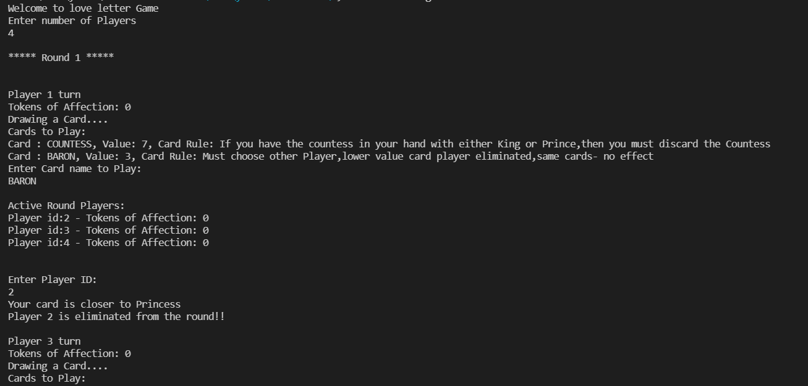

# Love Letter game in Csharp

## To run
Install .net 
Setup vs code
Install c# extension
Go to the new folder 
Open cmd on it
Run "dotnet new console"
Open that folder in vs code 
Click yes if asked 
Paste the .cs files from zip files in that folder
Then on terminal run "dotnet run"

## Rules

 

# Some visuals

## Extended functionality
Now game store its state for user to resume game play